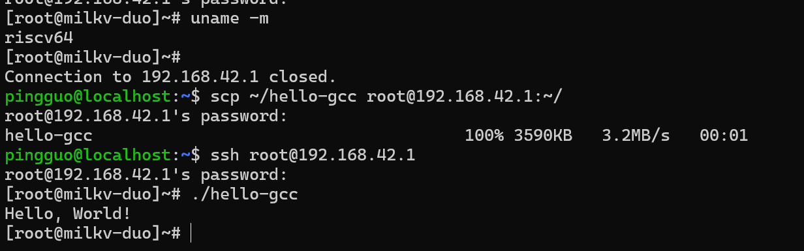

# Milk-V Duo S 开发板 Hello World 测试报告

## 测试环境

### 操作系统信息

- 系统版本：milkv-duos-musl-riscv64-sd_v2.0.1
- 下载链接：https://github.com/milkv-duo/duo-buildroot-sdk-v2/releases/download/v2.0.1/milkv-duos-musl-riscv64-sd_v2.0.1.img.zip
- 参考安装文档：https://github.com/milkv-duo/duo-buildroot-sdk-v2

### 硬件信息

- Milk-V Duo S (512M, SG2000)
- USB C to C 线缆一条，用于给开发板供电
- microSD 卡一张
- USB 读卡器一个

## 操作系统安装与启动验证

### 下载 Duo S 的镜像

```bash
wget https://github.com/milkv-duo/duo-buildroot-sdk-v2/releases/download/v2.0.1/milkv-duos-musl-riscv64-sd_v2.0.1.img.zip
```

### 解压镜像文件

```
unzip milkv-duos-musl-riscv64-sd_v2.0.1.img.zip
```

### 刷写镜像

用 dd 刷写镜像到 sd 卡：
```shell
sudo dd if=milkv-duos-musl-riscv64-sd_v2.0.1.img of=/dev/sdx bs=1M status=progress
```

### 插入 SD 卡并启动开发板
将 microSD 卡插入 Milk-V Duo S，重启。

### 创建并激活 Ruyi 虚拟环境（GCC）

```
# 创建虚拟环境
ruyi venv -t toolchain/gnu-plt milkv-duo venv-gnu-plt-duo

# 激活虚拟环境
source ~/venv-gnu-plt-duo/bin/ruyi-activate
```

### 验证 GCC 版本

```
riscv64-plt-linux-gnu-gcc -v
```

### Hello World（GCC）

```
cat << EOF > hello.c
#include <stdio.h>

int main() {
    printf("Hello, World!\n");
    return 0;
}
EOF
```

### 编译 Hello World （GCC）

```
riscv64-plt-linux-gnu-gcc hello.c -static -o hello-gcc
```

### 传输可执行文件至开发板

```
scp hello-gcc root@192.168.42.1:~/
```

### 确认系统重启成功
```
ssh root@192.168.42.1

默认用户名：`root`
默认密码：`milkv`
```
密码输入后登录成功，执行架构确认：
```
[root@milkv-duo]~# uname -m
riscv64
```

### 执行程序

```
./hello-gcc
```


## 预期结果

在本次测试中，预期达到以下成果：

1. **系统初始化完成**  
    成功完成开发板系统镜像的下载与烧录，能够通过 SSH 正常登录系统，并完成基础网络配置，确保开发板具备后续测试所需的运行环境。
    
2. **RuyiSDK 编译环境可用**  
    在宿主机成功完成 Ruyi 虚拟环境的创建与激活，确保交叉编译工具链可正常使用。
    
3. **GCC 工具链功能验证**  
    成功创建并激活 GCC 虚拟环境，能够正确识别 GCC 版本；使用 GCC 工具链完成 Hello World 程序的编译与运行，并通过 SCP 传输至开发板成功运行，输出预期结果。
    
4. **测试流程完整**  
    测试完成后可正常退出虚拟环境。

## 实际结果

本次测试实际取得的成果如下：

1. **系统初始化结果**  
    已完成目标开发板系统镜像的烧录与部署，开发板可通过 SSH 成功登录系统，并完成基础网络配置，系统运行稳定，满足测试需求。
    
2. **RuyiSDK 环境部署结果**  
    成功创建并激活 Ruyi GCC 虚拟环境，交叉编译工具链可正常使用。
    
3. **GCC 工具链测试结果**  
    GCC 虚拟环境创建与激活成功，GCC 版本信息可正确获取；Hello World 程序可正常编译并在开发板上运行。
    
4. **测试流程完成情况**  
    所有测试步骤执行完成后，虚拟环境可正常退出。

## 测试判定标准

测试成功：实际结果与预期结果相符。

测试失败：实际结果与预期结果不符。

## 测试结论

测试成功。
